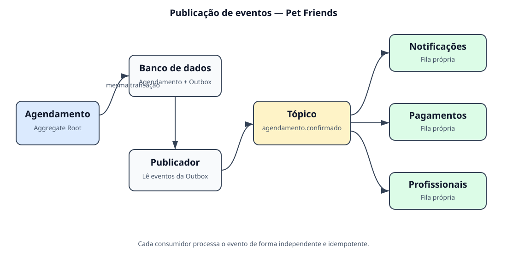

# TP2 — Agregados, transações e eventos de domínio

> Antes da exportação, inserir a capa institucional com título do trabalho, escola, turma, disciplina, professor e nome do aluno. Este documento não necessita de sumário.

## 1. Explique de forma sucinta qual a razão de criar Agregados.

**Resposta:** Agregados agrupam entidades e objetos de valor que precisam permanecer consistentes. A raiz do agregado controla as alterações e protege as regras do conjunto.

## 2. O que significa “consistência transacional”?

**Resposta:** Significa que uma transação leva os dados de um estado válido a outro. Se alguma operação falhar, nenhuma alteração parcial deve permanecer. No DDD, a consistência imediata costuma ficar dentro de um agregado.

## 3. Cite as 4 propriedades cruciais que definem transações.

**Resposta:** São as propriedades ACID:

- **Atomicidade:** todas as operações da transação acontecem ou nenhuma acontece.
- **Consistência:** a transação leva os dados de um estado válido para outro estado válido.
- **Isolamento:** transações simultâneas não devem produzir interferências indevidas entre si.
- **Durabilidade:** depois da confirmação, os dados persistem mesmo que o sistema sofra uma falha.

## 4. O que são “invariantes de negócio”?

**Resposta:** São condições que devem permanecer verdadeiras em toda operação. No Pet Friends, por exemplo, somente um agendamento pendente pode ser confirmado.

## 5. Porque um agregado só deve ter acesso a outro agregado pelo ID?

**Resposta:** A referência por ID preserva a independência dos agregados, reduz o acoplamento e evita transações envolvendo grandes redes de objetos. Cada agregado é carregado e alterado separadamente.

## 6. Crie um trecho de código Java de uma entidade que represente um agregado e faça referência a outro agregado dentro do escopo do projeto Pet Friends.

**Resposta:** `Agendamento` é a raiz e guarda somente os IDs dos agregados `Tutor` e `Pet`.

```java
public final class Agendamento {
    private final UUID id;
    private final TutorId tutorId; // referência ao agregado Tutor por ID
    private final PetId petId;     // referência ao agregado Pet por ID
    private final LocalDateTime horario;
    private Status status;

    public Agendamento(UUID id, TutorId tutorId, PetId petId,
                       LocalDateTime horario) {
        this.id = Objects.requireNonNull(id);
        this.tutorId = Objects.requireNonNull(tutorId);
        this.petId = Objects.requireNonNull(petId);
        this.horario = Objects.requireNonNull(horario);
        if (!horario.isAfter(LocalDateTime.now())) {
            throw new IllegalArgumentException("O agendamento deve ser futuro");
        }
        this.status = Status.PENDENTE;
    }
}
```

Código completo: [`Agendamento.java`](src/main/java/br/edu/infnet/petfriends/domain/Agendamento.java).

## 7. Elabore um trecho de código Java que mostre um método de negócio com a previsão de publicação de um evento de domínio dentro do escopo do projeto Pet Friends.

**Resposta:** O método valida a transição, altera o estado e registra o evento para publicação posterior.

```java
public void confirmar() {
    if (status != Status.PENDENTE) {
        throw new IllegalStateException(
                "Somente agendamentos pendentes podem ser confirmados");
    }

    status = Status.CONFIRMADO;
    eventos.add(AgendamentoConfirmado.agora(id, tutorId, petId, horario));
}
```

Código completo: [`Agendamento.java`](src/main/java/br/edu/infnet/petfriends/domain/Agendamento.java).

## 8. O que é “evento de domínio”?

**Resposta:** É o registro imutável de um fato relevante que já ocorreu no negócio, como `AgendamentoConfirmado`. Ele permite que outras partes do sistema reajam sem acoplamento direto com o agregado.

## 9. Crie um trecho de código Java que mostre uma abstração de um objeto do tipo “evento de domínio”.

**Resposta:** A interface define identidade, instante de ocorrência e tipo do evento.

```java
public interface EventoDominio {
    UUID eventoId();
    Instant ocorridoEm();
    String tipo();
}
```

Código completo: [`EventoDominio.java`](src/main/java/br/edu/infnet/petfriends/domain/EventoDominio.java).

## 10. Crie um trecho de código Java que mostre a implementação de um “evento de domínio” dentro do escopo do projeto Pet Friends.

**Resposta:** O evento imutável registra os dados do agendamento confirmado.

```java
public record AgendamentoConfirmado(
        UUID eventoId,
        Instant ocorridoEm,
        UUID agendamentoId,
        TutorId tutorId,
        PetId petId,
        LocalDateTime horario
) implements EventoDominio {

    @Override
    public String tipo() {
        return "agendamento.confirmado";
    }
}
```

Código completo: [`AgendamentoConfirmado.java`](src/main/java/br/edu/infnet/petfriends/domain/AgendamentoConfirmado.java).

## 11. Qual é a diferença entre filas e tópicos e como estes elementos funcionam em conjunto?

**Resposta:** Em uma fila, cada mensagem é entregue a um consumidor do grupo. Em um tópico, a mesma publicação chega a vários assinantes. Eles trabalham juntos quando cada assinante do tópico possui uma fila própria, como Notificações e Pagamentos ao receberem `agendamento.confirmado`.

## 12. Dê um exemplo de solução de arquitetura para publicação de eventos de domínio dentro do escopo do projeto Pet Friends (ideal um desenho).

**Resposta:** O serviço salva o agendamento e o evento em uma *outbox* na mesma transação. Um publicador envia o evento ao tópico, que o distribui às filas de Notificações, Pagamentos e Profissionais.



A *outbox* evita que o agendamento seja salvo sem que seu evento possa ser publicado. Os consumidores devem ser idempotentes para tolerar reentregas.

## 13. Explique qual a finalidade de uma Event Store no contexto de eventos de domínio.

**Resposta:** Event Store é um armazenamento ordenado e imutável dos eventos. Ela mantém o histórico dos agregados, permitindo auditoria, reconstrução de estado e criação de projeções. Diferentemente de uma fila, sua finalidade principal é persistir o histórico.

## 14. O que é Event Sourcing e como ele se diferencia da persistência tradicional em bancos de dados relacionais? Explique como os eventos salvos são usados para recuperar o estado atual de um Agregado.

**Resposta:** No Event Sourcing, a fonte de verdade é a sequência de eventos, enquanto a persistência tradicional guarda principalmente o estado mais recente. Eventos como `AgendamentoCriado` e `AgendamentoConfirmado` são acrescentados ao histórico sem sobrescrever os anteriores. Para recuperar o agregado, os eventos são carregados na ordem e reaplicados até formar o estado atual. Um *snapshot* pode acelerar históricos muito longos.

## Evidências de código das questões 6, 7, 9 e 10

Os arquivos estão nos links relativos apresentados em cada resposta e podem ser capturados em tela para o PDF. Depois que este projeto for publicado no GitHub, substituir esta observação pela URL pública do repositório ou inserir as capturas exigidas pelo enunciado.
